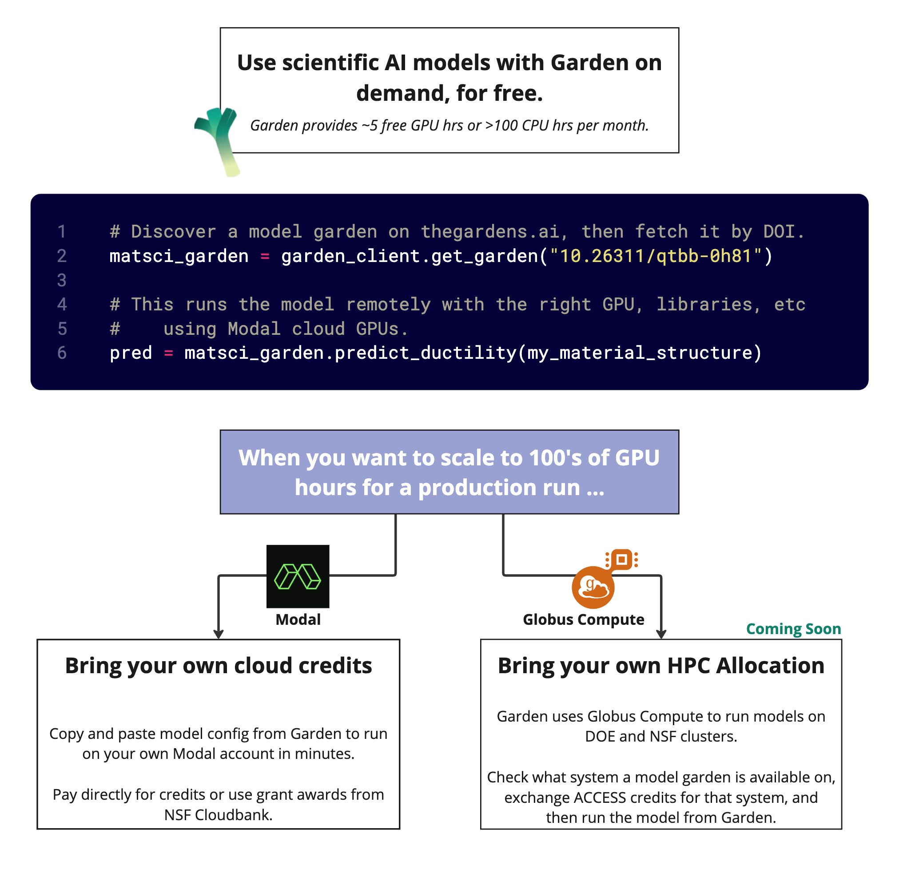

---
hide:
  - navigation
---
# 🌱 Garden-AI Documentation 🌱

Garden helps researchers find, share, and **run** scientific AI models for materials science, structural biology, astrophysics, and more. If a model is on Garden, you can run it, right now.

## Using Existing Models

  

Garden lets you browse collections ("gardens") of AI models  on [thegardens.ai](https://thegardens.ai). These model gardens might be grouped by task, like a collection of materials property predictors that have the same input/output shape but use different architectures. They can also be grouped by theme, like a collection of biology models that perform different tasks but were chained together in a protein generation pipeline.

Model gardens bring together serialized models ("weights"), code to invoke the model, training datasets, and papers. Most importantly, models on Garden are _runnable_. You can use the Garden Python SDK to run a model on your own data. When you call a model, Garden spins up a remote environment on demand using [Modal](https://modal.com/), runs the model remotely, and returns the output to your local environment. This lets you quickly "shop" for the right model for your research without setting up a different environment for every model you want to evaluate.

## Adding Models to Garden

It's easy to get new models running in Garden. If you are a model developer, Garden is a great way to make your work accessible to other researchers in your field and get more citations. But you can also use Garden to share working versions of models you didn't develop yourself, cultivate a collection of models useful in your field, develop living benchmarks, and more.

If you are interested in making models available on Garden, reach out to us at [gardens@teams.uchicago.edu](mailto:garden@teams.uchicago.edu) - we just need to make sure you're not a spambot. Then you can find instructions on how to publish with Garden [here](user_guide/modal-publishing.md).

## Getting Started

New to Garden? Here are some great places to begin:

## For Users

- [Publishing with Modal](user_guide/modal-publishing.md) - Learn how to publish a Garden using [Modal](https://modal.com)

## Additional Resources

- [thegardens.ai](https://thegardens.ai) - Our website, where you can create and explore published gardens
- [SDK Reference](api-docs.md) - Documentation for user-facing classes and helper functions

## For Developers

- [Contributing Guide](developer_guide/contributing.md) - Join our community and help improve Garden
- [Garden's GitHub Repository](https://github.com/Garden-AI/garden) - Explore our source code and contribute

Happy gardening! 🌱
