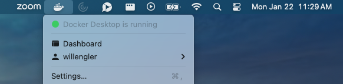
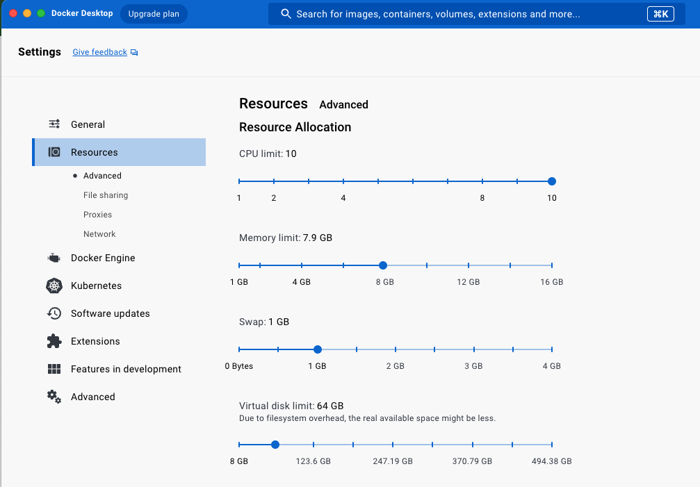
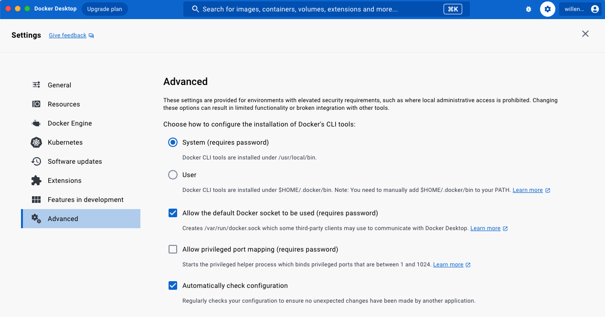

# Installing Docker on Your Computer

This guide is for users installing Docker on their computer for the first time. If you already have Docker running, you don't need to go through this. If `garden-ai docker check` runs successfully, you can move on.

## What is Docker?

Docker is a tool for creating, managing, and running _containers_. Containers are isolated environments for running code. Containers package all the dependencies and libraries your code needs to run, down to the operating system. This makes sure that containers will run the same even when they're running on different infrastructure. [Learn more here.](https://www.docker.com/resources/what-container/)

## Why does Garden need Docker?

- **Consistency across environments** Garden creates a fresh Docker container for you to write your model inference code in. Then Garden freezes the container you made locally and publishes it. This makes sure that if you get your model working locally, Garden will be able to run it remotely.
- **Reproducibility over time** Freezing the operating system, machine learning libraries, and code in a container makes sure that your model will still be runnable years from now.

## How do I install Docker?

### MacOS and Windows

For Mac and Windows, we recommend installing Docker Desktop. Docker Desktop is a desktop application that lets you manage Docker containers on your computer. [You can download it here.](https://www.docker.com/products/docker-desktop/)

Docker Desktop also runs the "Docker Daemon", a background program that actually does the work of creating and running containers. Under the hood, Garden connects to the Docker Daemon to manage containers.

To use Docker Desktop you will need to make a Docker account. This is quick and only requires a username and password.

### Linux

On Linux, we recommend installing Docker Engine. This runs the Docker Daemon with no GUI. The method will vary depending on your distro. [Check here for instructions for different distros, including Ubuntu, RHEL, and CentOS](https://docs.docker.com/engine/install/#supported-platforms).

## Checking your installation

To test your Docker installation, try running

```
docker run hello-world
```

This should download a small container that prints "Hello from Docker!" and some helpful information about Docker.

You can also run

```
garden-ai docker check
```

to make sure that the Docker Daemon is currently running on your computer and that the Garden CLI can access it.

## Troubleshooting your installation

If `garden-ai docker check` shows that Garden can't access Docker, there are a few things to check.

### Is Docker running?

If the Docker Daemon isn't running, turn it on.

- _Docker Desktop_: Make sure you've turned on the Docker Desktop app. On MacOS you should see a whale icon in your taskbar. That means that Docker Desktop and the Docker Daemon are running.



- _Docker Engine on Linux_: Follow docs for your particular distro. You probably need use your distro's service management utility, like `systemctl` or `service`. [See here for help getting Docker to start automatically with systemd.](https://docs.docker.com/engine/install/linux-postinstall/#configure-docker-to-start-on-boot-with-systemd)

### Does your user have permissions to use the Docker Daemon?

This is a common issue on Linux. Docker is often installed so that only the `root` user can invoke Docker by default. But we don't recommend running garden-ai with sudo. Instead, make sure your normal user has permissions to use Docker.

Normally installation will create a `docker` group where members of that group can use Docker. If that's the case on your distro, try running this command with your username.

```
sudo usermod -aG docker your-user-name
```

This should work to let your unprivileged user use Docker.

### Do you have enough disk space?

If you are using Docker Desktop, it will proactively claim some disk space on your computer. By default it claims 64GB. If you don't have that much free disk space, Docker won't be able to run. You can configure this amount in _Settings_ (click the gear icon) -> _Resources_ -> _Virtual disk limit in the GUI._



### Does Docker let other programs (like Garden) call its daemon?

When CLI programs (like garden-ai) try to use Docker, they look for the Docker Daemon at `/var/run/docker.sock`. In Docker Desktop, you can make sure that Docker exposes this socket at _Settings_ (click the gear icon) -> _Advanced_ -> _Allow the default Docker socket to be used._ Make sure this box is checked.


