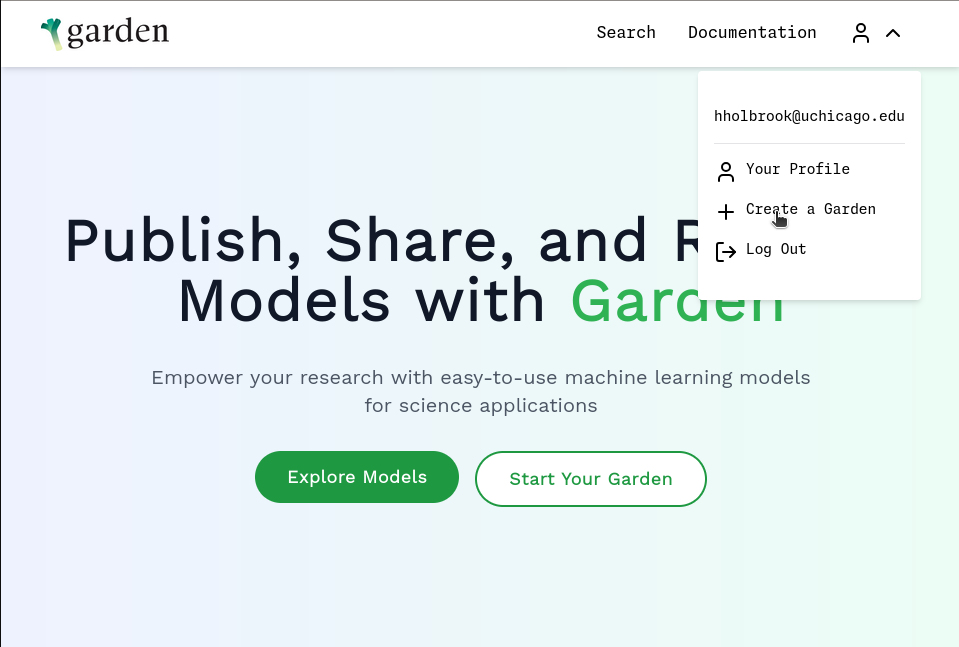
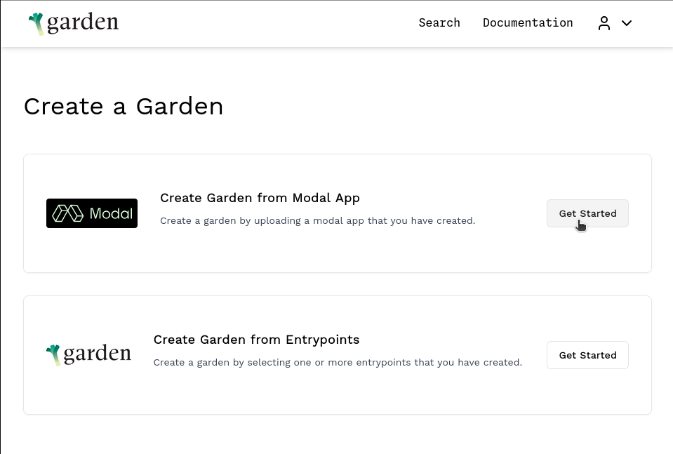
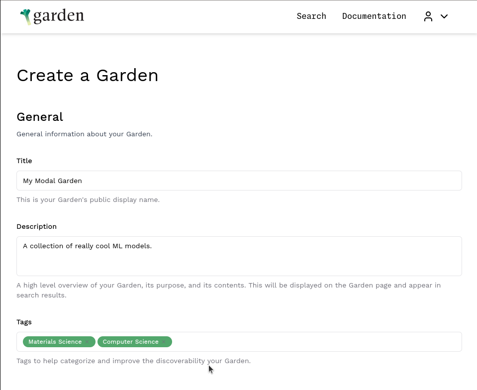
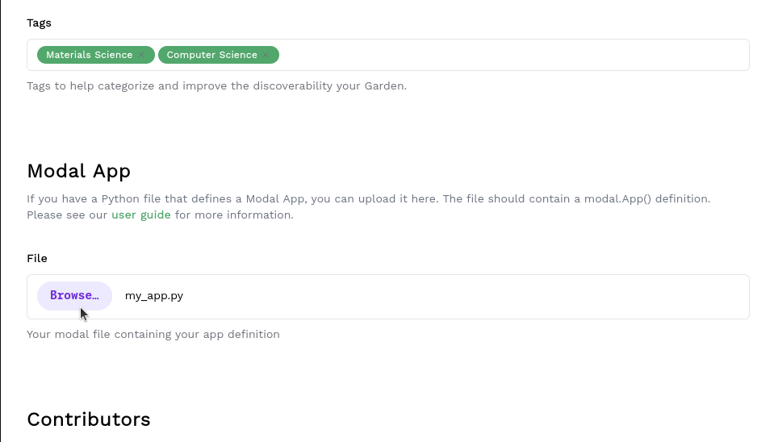
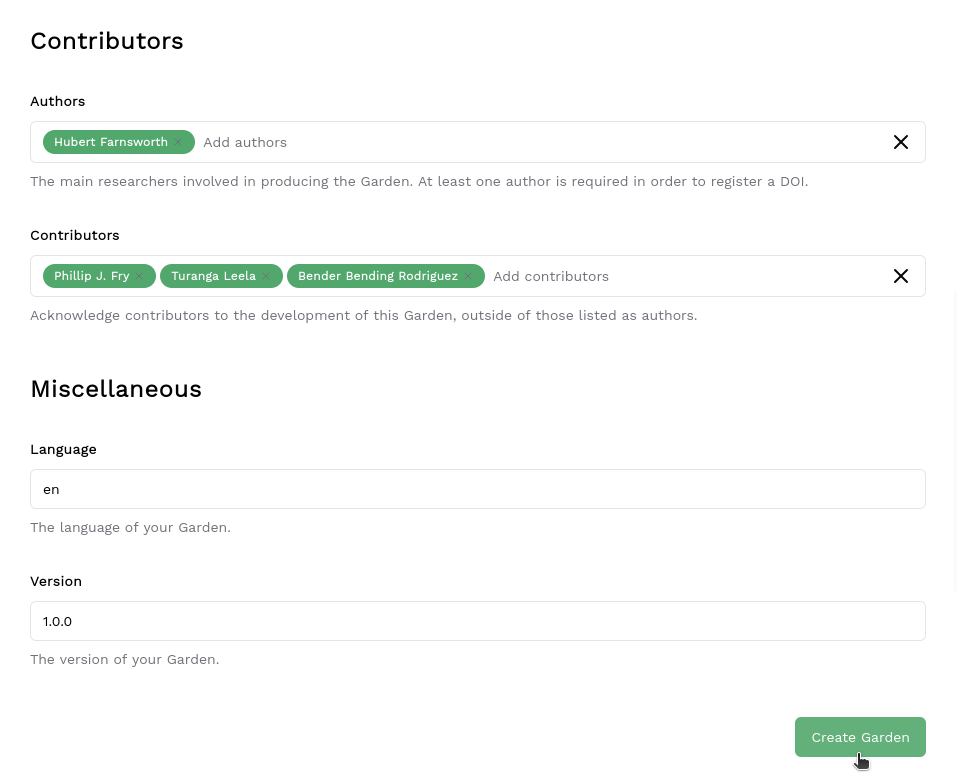

## 1. Create a Modal Account

**Prerequisite:** This step requires a free [GitHub](https://github.com/join) account to authenticate with Modal.

Create a free Modal account by linking your GitHub: [signup](https://modal.com/signup).

**NOTE:** You'll also get $30/month of free compute credit for your personal account. It's totally safe to spend those credits developing and debugging your modal functions before you publish them with garden -- modal functions run through garden won't charge your personal account.

## 2. Author a Modal App

### Create a Modal file

Modal files are regular python scripts. Create a new python file in your project:

```bash
$ touch my_app.py
```

You can also use modal's [interactive playground](https://modal.com/playground/get_started) to develop your modal function.

### Imports

```python
# my_app.py

# Import the Modal SDK
import modal
```

### Define the Modal App

Create a `modal.App` object where your custom functions will be registered.
Modal apps need to be assigned to a variable named `app` and at the top-level (global) scope.

```
app = modal.App("my-cool-app")
```

### Define Modal functions

Modal functions are regular python functions that have been decorated with `@app.function()`.
The `@app.function()` decorator registers the function with the `modal.App` created above.
Like Modal Apps, Modal functions need to be defined in the global scope.

```python
# Define a function and register it with the app
# Functions can be named anything you like
@app.function()
def my_awesome_function(data):
  result = sum(data)
  return result


# You can register multiple functions to the same app
@app.function()
def my_other_cool_function(data):
  result = max(sum(data), 42)
  return result

```

### The Complete Modal File

That is all we need to do to define a Modal App that can be published with Garden! See the complete modal file below:
See the [Modal docs](https://modal.com/docs/guide) for more details on defining Modal Apps and functions.

```python
# my_app.py

# Import the Modal SDK
import modal

# Define your App -- this is the top-level entity that holds references to functions
# It must be assigned to a variable named 'app' for Garden to extact it properly
app = modal.App("my-cool-app")

# Define a function and register it with the app
# Functions can be named anything you like
@app.function()
def my_awesome_function(data):
  result = sum(data)
  return result

# You can register multiple functions to the same app
@app.function()
def my_other_cool_function(data):
  result = max(sum(data), 42)
  return result
```

## 3. Upload your App to Garden

### Create a new Garden

Create a Garden and upload your Modal App on the [Create Garden](https://thegardens.ai/#/garden/create) page.

Or Click 'Create a Garden' from the [Garden Home Page](https://thegardens.ai)



Then click 'Get Started' on the option to create a garden from a Modal App.



### Fill in Garden Details

Fill in the general details about your garden including a title, description of the Garden, and any tags you want to add.



### Upload the Modal App

Upload the Modal App by clicking 'Browse' and selecting the python file defining your Modal App.



### Add Contributors

Fill in information about the authors and any contributors to the Garden.



### Submit

When the information is correct click 'Create Garden'!

It may take a few minutes for the deployment process to finish.

Check the 'My Gardens' tab on your [Profile](https://thegardens.ai/#/user) page for the new Garden and note the DOI for the next step.

## 4. Run your functions using Garden

After uploading your Modal App to Garden, you should have a new DOI referencing the Garden you created.

You can run your Modal functions like any other Entrypoint published on Garden:

```python
from garden_ai import GardenClient

# the doi of the Garden created in step 3
garden_doi = "10.1234/567-8910f"


data = [1, 2, 3, 4, 5]

client = GardenClient()
garden = client.get_garden(garden_doi)

# Function is executed remotely on Modal!
result = garden.my_awesome_function(data)
```
