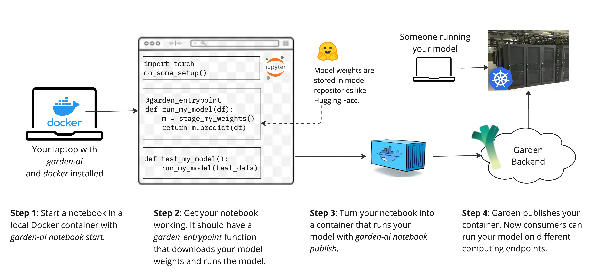

## Publish Your First Model in 15 Minutes

In this tutorial you will publish a trained ML model with Garden. Then you can invoke the model remotely on a Garden demo server.



For this walkthrough, we will deploy a simple Scikit-Learn model that classifies irises. We already have the trained model [here in a public Hugging Face repository](https://huggingface.co/Garden-AI/sklearn-seedling/tree/main). You do not need to train a model yourself for this tutorial.

### Prerequisites

- You need the Garden CLI (`garden-ai`) installed on your computer.
    - We recommend installing with [pipx](https://github.com/pypa/pipx?tab=readme-ov-file#pipx--install-and-run-python-applications-in-isolated-environments) like `pipx install garden-ai`.
    - [See here for more instructions on installing garden-ai.](user_guide/installation.md)
- You need Docker installed on your computer.
    - [See here for instructions on installing Docker.](user_guide/docker.md)
- You need a Globus account. (TODO: explain and link)

Confirm you have Garden and Docker installed.

```bash
garden-ai docker check
```

If you see a flower you're good to go.

```bash
Docker is running and accessible. Happy Gardening!

     /\^/`\
    | \/   |
    | |    |
    \ \    /
     '\\//'
       ||
       ||
       ||
       ||  ,
   |\  ||  |\
   | | ||  | |
   | | || / /
    \ \||/ /
jgs  `\//`
    ^^^^^^^^
```

!!! info

    If `garden-ai docker check` reports issues with Docker, [look at our Docker troubleshooting guide.](docker.md#troubleshooting-your-installation)

### Step 1: Create a Garden

Gardens are collections of related machine learning models that you can curate. A chemist might create a garden of interatomic potential predictiors to compare different frameworks and architectures.

Create a simple garden so you can add your model to it later.

```
garden-ai garden create \
    --title "Tutorial Garden" \
	--author "Your Name"
```

In the output of that command, you should see something like:
```bash
...
Garden 'Tutorial Garden' created with DOI: 10.23677/z2b3-3p02
```

Make note of this DOI for later.

!!! info

    You can also use `garden-ai garden list` to list all of your gardens and see their DOIs.


### Step 2: Start a Notebook in an Isolated Environment

Garden creates an isolated Docker environment for you to write and test code that executes your model. This helps Garden save and recreate the exact environment you need to run your model on remote servers. Garden opens a Jupyter notebook from within the isolated Docker environment that you can edit from your web browser.

Start your notebook in an isolated environment.

```bash
garden-ai notebook start tutorial_notebook.ipynb --base-image=3.10-sklearn --tutorial
```

!!! info
    The `base-image` option lets you pick a premade environment, or "image" in Docker-speak. This lets you start off with the Python version and ML framework that you need. You can still install more packages within this base environment.

    We will be serving a Scikit-Learn model trained and serialized with Python 3.10, so we will use the `3.10-sklearn` base image. Use `garden-ai notebook list-premade-images` to see other base images you can choose from.

Garden will ask you to confirm if you want to do this. Type `y` and hit enter.

```bash
This will create a new notebook foo.ipynb and open it in Docker image gardenai/base:python-3.10-jupyter-sklearn.
Do you want to proceed? [y/N]: y
```

You should see output like this:

```bash
Using base image: gardenai/base:python-3.10-jupyter-sklearn
Notebook started! Opening http://127.0.0.1:8888/notebooks/tutorial_notebook.ipynb in your default browser (you may need to refresh the page)

[stream of jupyter logs]
```

You'll notice that your notebook already has some code. When Garden creates a notebook from scratch, it includes instructions and sample code to help get you started. You won't need the sample code for this tutorial so feel free to delete these premade cells.

!!! note
    The Jupyter notebook file (tutorial_notebook.ipynb) is shared across your computer's filesystem and the container filesystem. So when you stop the containerized Jupyter server you will still have your notebook.

!!! warning
    Be sure to save your notebook manually as you go! The local Jupyter server doesn't auto-save as frequently as Colab.

### Step 3: Write a Function That Invokes Your Model

Now it's time to actually write the code that executes your model. The notebook you've opened will serve two big roles in publishing your model.

1. **Defining the "entrypoint" function that runs your model.** The notebook will contain a function called an entrypoint. This is the function that will run on a remote server when someone wants to invoke your model.
2. **Defining the context that your entrypoint function will run in.** Other code in your notebook - helper functions, import statements, etc - will be available to your entrypoint function when it is called. You can also include code that installs extra packages or edits files on the container.

Because you passed the `--tutorial` flag to `garden-ai notebook start`, you should be looking at a notebook that's already populated with code and instructions on how to run the iris model. From here, just work through the notebook. Come back when you're done.

...

Next, we fill out the citation metadata for our `Entrypoint`:
```ipython
from garden_ai.entrypoints import EntrypointMetadata
my_entrypoint_meta = EntrypointMetadata(
    title="Irises, Classified through the Looking-Glass",
    authors=["Dee, Tweedle", "Dum, Tweedle", "Alice"],
    tags=["fiction", "science"],
    short_name="looking_glass_entrypoint",
)
```
This metadata is used to mint a DOI for the `Entrypoint` automatically, and is key for the discoverability of your work. A title and list of at least one author are required; for a full list of allowed metadata fields, see: [Entrypoints](../Entrypoints.md).


> [!NOTE] the `short_name` field
> Calling the `Entrypoint` from a `Garden` object uses method-like syntax, e.g. `my_garden.some_entrypoint(*args, **kwargs)`. The `some_entrypoint` identifier is set by the Entrypoint's `short_name` field, and by default is just the underlying function's name.


Next, we'll want to make sure our `Entrypoint` function will have access to the model weights we're storing on huggingface, which we do with a "Model Connector" like so:
```ipython
from garden_ai.model_connectors import HFConnector
tutorial_hf_repo = HFConnector("Garden-AI/sklearn-seedling")
```

>[!NOTE] Note
> Our `Entrypoint` function could simply download the weights from huggingface directly, but by using a Model Connector, like the `HFConnector` above, we can automatically extract any model metadata provided by huggingface and associate it with the `Entrypoint` that uses the model.

We can now define a function for our `Entrypoint` which uses the `tutorial_hf_repo` connector to download the model (as well as a helper function to clean the input data):

```ipython
import pandas as pd
import joblib

def preprocess(input_df: pd.DataFrame) -> pd.DataFrame:
    input_df.fillna(0, inplace=True)
    return input_df


def run_tutorial_model(input_df: pd.DataFrame) -> pd.DataFrame:
    """Clean input data, load pretrained model weights, and run inference."""
    cleaned_df = preprocess(input_df)
    # use our model connector's `.stage()` method to download model weights
    download_path = tutorial_hf_repo.stage()
    model = joblib.load(f"{download_path}/model.joblib")
    return model.predict(cleaned_df)
```

But our `run_tutorial_model` function isn't a proper `Entrypoint` yet -- we still need to mark it as an `Entrypoint` and link the `EntrypointMetadata` to the function. We do this with the `@garden_entrypoint` decorator:

```ipython
from garden_ai import garden_entrypoint

import pandas as pd
import joblib

# helper, no need to decorate
def preprocess(input_df: pd.DataFrame) -> pd.DataFrame:
    input_df.fillna(0, inplace=True)
    return input_df


@garden_entrypoint(
	metadata=my_entrypoint_meta,            # link EntrypointMetadata from above
	model_connectors=[tutorial_hf_repo],  # link HFConnector metadata
	garden_doi="10.23677/z2b3-3p02",      # publish to the Garden we created earlier
)
def run_tutorial_model(input_df: pd.DataFrame) -> pd.DataFrame:
    """Clean input data, load pretrained model weights, and run inference."""
    cleaned_df = preprocess(input_df)
    # use our model connector's `.stage()` method to download model weights
    download_path = tutorial_hf_repo.stage()
    model = joblib.load(f"{download_path}/model.joblib")
    return model.predict(cleaned_df)
```

Now that we've finished developing our `Entrypoint`, it's a good idea to restart the kernel and run all cells to sanity-check that your entrypoint function is working as expected before moving on to the publication step.


### Step 4: Publishing the Notebook

Finally, we're ready to finalize and publish our `Entrypoint`, making it reproducible and discoverable as part of a `Garden`.


The only thing we need to do now is call `garden-ai notebook publish` with our notebook path and our image repository, like so:

```bash
$ garden-ai notebook publish tutorial_notebook.ipynb --requirements=conda.yml
```

Your output should look something like this:
```bash
$ garden-ai notebook publish tutorial_notebook.ipynb
Using base image: gardenai/base:python-3.10-jupyter-sklearn
Using image repository: johntenniel/garden-images
Building image ...
Built image: <Image: ''>
Pushing image to repository: johntenniel/garden-images
Successfully pushed image to: docker.io/johntenniel/garden-images:tutorial_notebook-20231130-135145
Added entrypoint 10.23677/stg7-cr32 (looking_glass_entrypoint) to garden 10.23677/z2b3-3p02 (Garden of Live Flowers)!
(Re-)publishing garden 10.23677/z2b3-3p02 (Garden of Live Flowers) ...
```

> [!NOTE] Adding to other Gardens
> Because we specified a `Garden` we wanted to publish to in the notebook itself (via an argument to the decorator), this automatically adds the `Entrypoint` to and re-publishes that `Garden` so others can discover and invoke it.
>
> If you want to add an `Entrypoint` to a `Garden` that wasn't specified when its notebook was first published, you can do so from the CLI with `garden-ai garden add-entrypoint`, then `garden-ai garden publish` to re-publish the `Garden`.

### Step 6: Remote Execution

Now that your Garden is published, let's see how you (or others) can find and use published Gardens.

#### Discover a Garden

If you don't already have the `Garden` DOI, you can find a published `Garden` by searching for it using the CLI. For example, this would list all published `Gardens` with "The Red Queen" listed as an author:

```bash
garden-ai garden search --author "The Red Queen"
```

Once we have the `Garden` DOI, we have everything we need to remotely execute any of its `Entrypoints` on a choice Globus Compute endpoint:

```python
>>> gc = GardenClient()
>>> live_flower_garden = gc.get_published_garden('10.23677/z2b3-3p02')
```

#### Remotely Execute an Entrypoint

Once you have the `Garden` object, you can execute any of its `Entrypoints` remotely. Make sure to specify a valid Globus Compute endpoint (or use the tutorial endpoint below):

```python
>>> my_data = pd.DataFrame(...)
>>> tutorial_endpoint = "86a47061-f3d9-44f0-90dc-56ddc642c000"
>>> results = live_flower_garden.looking_glass_entrypoint(my_data, endpoint=tutorial_endpoint)
# ... executing remotely on endpoint 86a47061-f3d9-44f0-90dc-56ddc642c000
>>> print(results)  # neat!
```

That's all there is to it! Happy Gardening 🌱

### Graveyard

The first cell of our notebook is often just a few `pip install`s:
```ipython
%pip install garden-ai==0.6.1
%pip install scikit-learn==1.3.0
%pip install joblib==1.3.2
# %pip install some-other-library etc
```

Best practice is to pin exact versions of your dependencies wherever possible, but this is especially important for the library used to train the model and/or originally save the model weights (`scikit-learn==1.3.0` and `joblib==1.3.2` in this case).

> [!NOTE] Note
> Doing `%pip install`s in the notebook is often very helpful for interactively experimenting with packages while coding. But once you've figured out all the packages and versions you need, we recommend pulling them out into a `requirements` file that you can pass to Garden with the `--requirements` flag.
